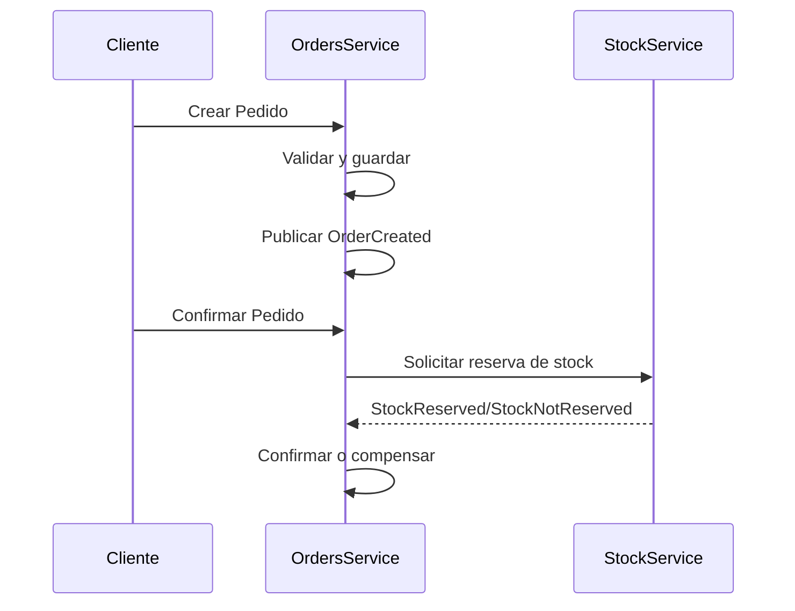

# Arquitectura y Modelo de Dominio

## Arquitectura General

- **Hexagonal Architecture**: Separación entre dominio, aplicación e infraestructura.
- **DDD**: El agregado principal es `Order`, con entidades `Part` y eventos de dominio.
- **Event-Driven**: Comunicación asíncrona entre servicios mediante eventos.

## Architecture Decision Records (ADRs)

### ADR-001: Arquitectura Hexagonal y DDD

- Contexto

El dominio de pedidos requiere flexibilidad y desacoplamiento para evolucionar y escalar.

- Decisión

Adoptar arquitectura hexagonal y DDD, separando dominio, aplicación e infraestructura.

- Consecuencias

  - Facilita testing y mantenimiento.
  - Permite cambiar infraestructura sin afectar el dominio.
  - Mayor curva de aprendizaje inicial.

### ADR-002: Comunicación Event-Driven

- Contexto

La gestión de pedidos depende de inventario y pagos, que pueden fallar o tardar.

- Decisión

Usar eventos asíncronos para integración entre servicios.

- Consecuencias

  - Mayor resiliencia y desacoplamiento.
  - Requiere lógica de compensación y manejo de errores.
  - Complejidad en la trazabilidad de flujos.
  - Necesidad de un bus de eventos o broker (ej: RabbitMQ, Kafka).
  - Aumenta la latencia en comparación con llamadas síncronas.

### ADR-003: Validación y Serialización

- Contexto
La aplicación necesita validar y serializar datos de manera consistente.

- Decisión

Usar `class-validator` y `class-transformer` para validar DTOs y serializar respuestas.

- Consecuencias

  - Mejora la consistencia y claridad del código.
  - Facilita la validación de datos de entrada y salida.
  - Requiere configuración de pipes e interceptores en NestJS.
  - Aumenta la complejidad inicial del proyecto.

## Modelo de Dominio

- **Order**
  - id: string
  - customerId: string
  - orderDate: number
  - deliveryDate: number
  - status: Pending | Confirmed | Shipped | Delivered | Cancelled
  - products: Product[]
  - Métodos: confirm(), cancel(), calculateTotal(), validateTransition()

- **Product**
  - id: string
  - name: string
  - quantity: number
  - price: string

## Validaciones

La aplicación cuenta con entidades y DTOs bien definidos.

Se hace uso de class-validator y class-serializer para validar los objetos de transferencia (DTOs) y serializar las respuestas.

Esto se consigue principalmente a través de los decoradores de validación en los DTOs, como `@IsString()`, `@IsNumber()`, etc.

Su implementación es realizada mediante los interceptores de NestJS, que permiten interceptar las solicitudes y respuestas para aplicar la validación y transformación de datos.

Específicamente, se utilizan:

- Pipes
  - **HttpValidationPipe**: Para validar los DTOs de entrada en contexto HTTP.
  - **gRPCValidationPipe**: Para validar los DTOs de entrada en contexto gRPC.

- Interceptors
  - **ClassSerializerInterceptor**: Para serializar las respuestas de los DTOs.

Además, para los eventos de dominio, se utiliza el método .toPlain() en los DTOs para convertir las entidades a objetos planos antes de publicarlos.

## Excepciones y Manejo de Errores

La aplicación maneja excepciones y errores de manera centralizada utilizando filtros de excepciones de NestJS.
Esto permite capturar errores de validación, errores de negocio y otros tipos de excepciones, proporcionando respuestas coherentes y estructuradas a los clientes.

## Flujos Principales

1. **Crear Pedido**
   - Validación de datos
   - Estado inicial: Pending
   - Publica evento `OrderCreated`

2. **Confirmar Pedido**
   - Solo si está en Pending
   - Solicita reserva de stock (evento)
   - Si stock reservado: cambia a Confirmed y publica `OrderConfirmed`
   - Si stock no reservado: ejecuta compensación (cancela pedido)

3. **Cancelar Pedido**
   - Solo si no está Shipped/Delivered
   - Publica evento `OrderCancelled`
   - Compensa stock si corresponde

## Diagrama de Secuencia (simplificado)

