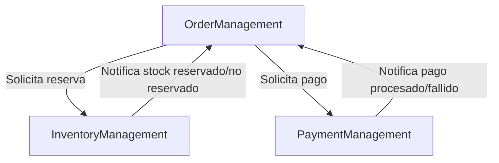

# Bounded Contexts y Context Map

## Identificados

1. **Gestión de Pedidos (Order Management)**
   - Responsable de la creación, actualización y ciclo de vida de los pedidos.

2. **Gestión de Inventario (Inventory Management)**
   - Responsable de la reserva y actualización de stock.

3. **Gestión de Pagos (Payment Management)**
   - Responsable de la autorización y procesamiento de pagos.

## Justificación

- Cada contexto tiene reglas de negocio y modelos propios.
- Permite escalar y evolucionar cada servicio de forma independiente.

## Context Map

