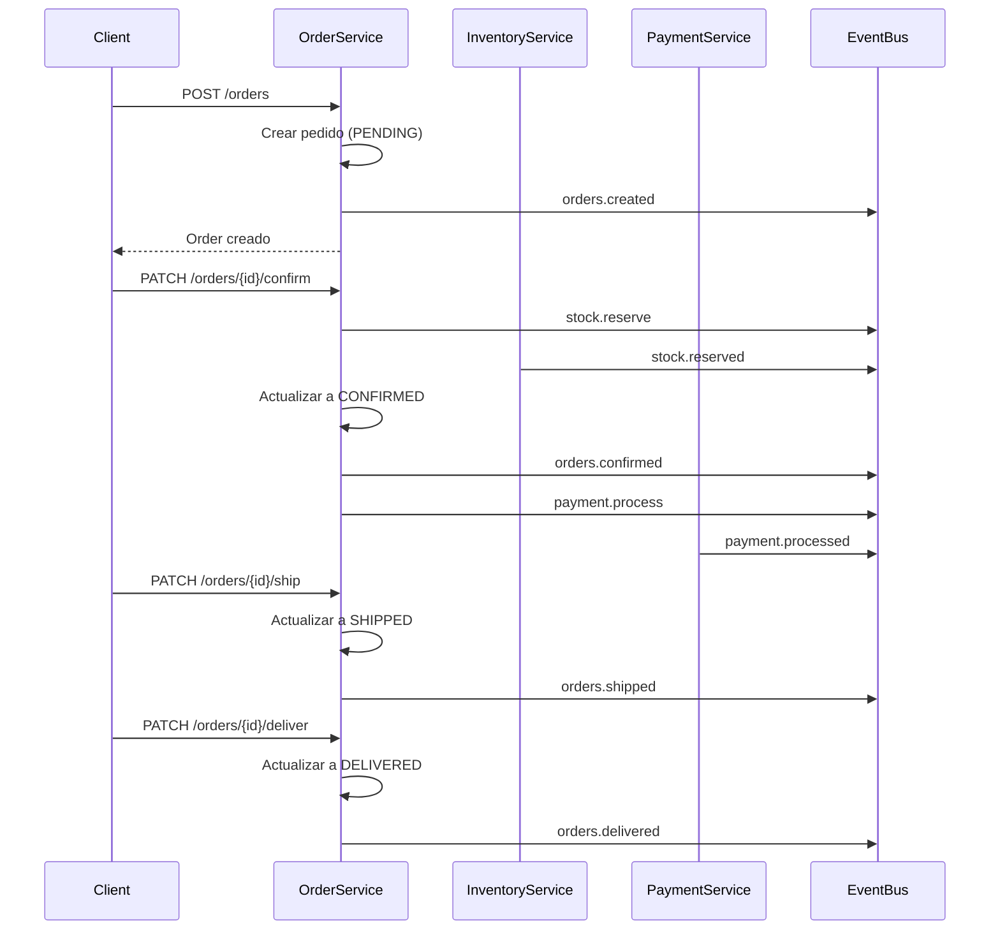

# Parte 1: Diseño

## 1.1 Identificación de Bounded Contexts

Basándome en el análisis del dominio de negocio y la implementación realizada, he identificado los siguientes **3 bounded contexts**:

### 1. Gestión de Pedidos (Order Management)

- **Responsabilidad**: Creación, actualización y ciclo de vida completo de los pedidos
- **Entidades principales**: Order, Product
- **Estados gestionados**: Pending, Confirmed, Shipped, Delivered, Cancelled
- **Operaciones**: CRUD de pedidos, validación de transiciones de estado, cálculo de totales

### 2. Gestión de Inventario (Inventory Management)

- **Responsabilidad**: Control y reserva de stock de productos
- **Operaciones**: Reserva de stock, liberación de stock, verificación de disponibilidad
- **Comunicación**: Responde a eventos de reserva y emite confirmaciones/rechazos

### 3. Gestión de Pagos (Payment Management)

- **Responsabilidad**: Autorización y procesamiento de pagos
- **Operaciones**: Procesamiento de pagos, validación de métodos de pago, compensaciones
- **Comunicación**: Procesa pagos y notifica resultados

### Justificación de la separación

- **Autonomía**: Cada contexto tiene reglas de negocio específicas y modelos de datos independientes
- **Escalabilidad**: Permite escalar cada servicio según su carga específica
- **Evolución independiente**: Los equipos pueden trabajar de forma autónoma en cada contexto
- **Responsabilidad única**: Cada contexto tiene una razón específica para cambiar
- **Acoplamiento débil**: La comunicación se realiza a través de eventos, minimizando dependencias directas

## 1.2 Diseño de Agregados

Para el bounded context de **"Gestión de Pedidos"**:

### Agregado Principal: Order

**Entidades:**

- **Order** (Aggregate Root)
  - `id`: string (UUID)
  - `customerId`: string (UUID del cliente)
  - `orderDate`: number (timestamp Unix)
  - `deliveryDate`: number (timestamp Unix)
  - `status`: OrderStatus (enum)
  - `products`: Product[] (colección de productos)

- **Product** (Entidad)
  - `id`: string (UUID del producto)
  - `quantity`: number (cantidad pedida)
  - `name`: string (opcional)
  - `description`: string (opcional)
  - `price`: string (precio unitario)

**Value Objects:**

- **OrderStatus**: Enum con valores (PENDING, CONFIRMED, SHIPPED, DELIVERED, CANCELLED)
- **Price**: Calculado dinámicamente basado en productos y cantidades

**Domain Events generados:**

- `orders.created` - Cuando se crea un nuevo pedido
- `orders.updated` - Cuando se actualiza un pedido
- `orders.confirmed` - Cuando se confirma un pedido
- `orders.shipped` - Cuando se envía un pedido
- `orders.delivered` - Cuando se entrega un pedido
- `orders.cancelled` - Cuando se cancela un pedido
- `orders.deleted` - Cuando se elimina un pedido
- `stock.reserve` - Solicitud de reserva de stock
- `stock.compensate` - Solicitud de compensación de stock

**Invariantes de negocio protegidas:**

1. **Transiciones de estado válidas**:
   - Solo se puede confirmar un pedido en estado PENDING
   - Solo se puede enviar un pedido CONFIRMED
   - Solo se puede entregar un pedido SHIPPED
   - No se puede cancelar un pedido SHIPPED o DELIVERED

2. **Integridad de productos**:
   - Un pedido debe tener al menos un producto
   - Las cantidades deben ser positivas
   - El precio total se calcula automáticamente

3. **Fechas consistentes**:
   - La fecha de entrega debe ser posterior a la fecha del pedido

4. **Compensación automática**:
   - Si se cancela un pedido CONFIRMED, se libera el stock automáticamente

## 1.3 Arquitectura de Microservicios

### Bounded Contexts como Microservicios

#### 1. Orders Service (Implementado)

- **Bounded Context**: Gestión de Pedidos
- **Base de datos**: PostgreSQL con entidades Order y Product
- **APIs**: REST (HTTP) y gRPC
- **Eventos**: Productor y consumidor Kafka

### 2. Inventory Service (Simulado)

- **Bounded Context**: Gestión de Inventario
- **Responsabilidad**: Reserva y liberación de stock
- **Eventos consumidos**: `stock.reserve`, `stock.compensate`
- **Eventos producidos**: `stock.reserved`, `stock.rejected`

### 3. Payment Service (Simulado)

- **Bounded Context**: Gestión de Pagos
- **Responsabilidad**: Procesamiento de pagos
- **Eventos consumidos**: `payment.process`
- **Eventos producidos**: `payment.processed`, `payment.failed`

## Contratos de API

**REST API (HTTP):**

```http
POST   /orders                    # Crear pedido
GET    /orders                    # Listar pedidos
GET    /orders/{id}               # Obtener pedido
PUT    /orders/{id}               # Actualizar pedido
DELETE /orders/{id}               # Eliminar pedido
PATCH  /orders/{id}/confirm       # Confirmar pedido
PATCH  /orders/{id}/ship          # Enviar pedido
PATCH  /orders/{id}/deliver       # Entregar pedido
PATCH  /orders/{id}/cancel        # Cancelar pedido
```

**gRPC API:**

- Mismas operaciones con interfaces de protobuf
- Mejor rendimiento para comunicación inter-servicios
- Tipado fuerte con mensajes definidos en `app.proto`

## Flujo completo de creación y procesamiento



## Comunicación entre servicios

**Comunicación Asíncrona (Event-Driven):**

- **Patrón principal**: Eventos de dominio vía Kafka
- **Ventajas**: Desacoplamiento, resiliencia, escalabilidad
- **Uso**: Operaciones de negocio, notificaciones, actualizaciones de estado

**Comunicación Síncrona (cuando es necesaria):**

- **gRPC**: Para consultas que requieren respuesta inmediata
- **HTTP**: Para APIs públicas y debugging
- **Timeouts**: Implementados interceptores de timeout para evitar bloqueos

**Manejo de Errores y Compensación:**

- **Dead Letter Queues (DLQ)**: Para mensajes que fallan procesamiento
- **Compensación automática**: Liberación de stock en cancelaciones
- **Retry policies**: Reintentos automáticos en fallos transitorios
- **Circuit breakers**: Protección contra servicios no disponibles

**Implementación técnica:**

- **Framework**: NestJS con TypeScript
- **Persistencia**: TypeORM con PostgreSQL
- **Mensajería**: Kafka (simulado en tests)
- **Validación**: class-validator y class-transformer con DTOs y entidades bien definidas
- **Testing**: Jest para unitarios y e2e completos
